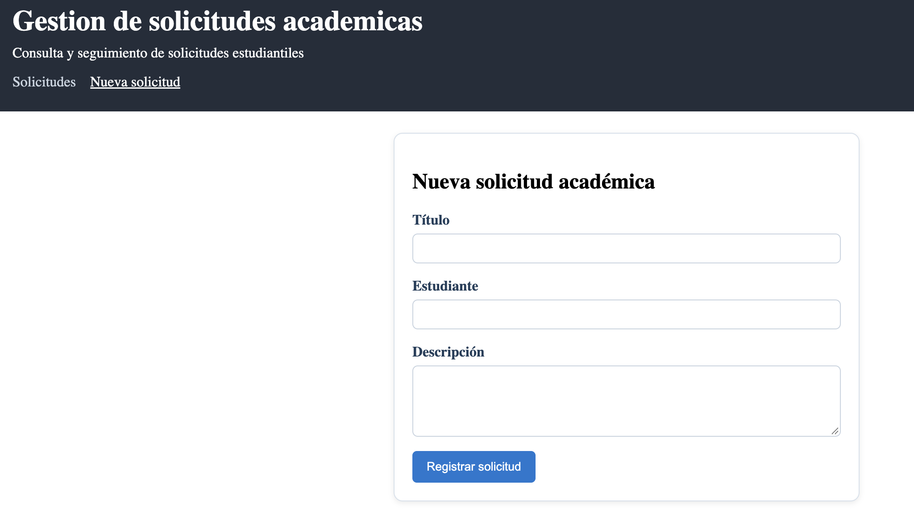
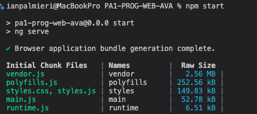
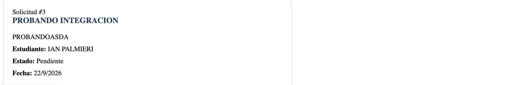

Actividad 3: Formulario reactivo, validaciones y navegación

Integrante responsable: Ian Palmieri Gonzaga

1. Qué implementé

- `SolicitudFormComponent` (`src/app/components/solicitud-form`), construido con `ReactiveFormsModule`, `FormBuilder` y `FormGroup`.
- Validaciones con `Validators.required` y `Validators.minLength` en los tres campos: título, estudiante y descripción.
- Mensajes de error debajo de cada campo cuando el control es inválido y fue tocado (`*ngIf="campo?.invalid && campo?.touched"`).
- Al enviar un formulario válido, se llama a `SolicitudService.agregarSolicitud(...)`, que agrega la nueva solicitud a la lista existente (misma fuente de datos que usa `SolicitudListaComponent`), y se muestra un mensaje de confirmación.
- Navegación con `RouterModule`: se agregaron las rutas `solicitudes` (listado, `SolicitudListaComponent`) y `nueva-solicitud` (formulario, `SolicitudFormComponent`) en `app-routing.module.ts`, con redirección por defecto de `''` a `solicitudes`.
- Enlaces de navegación (`routerLink` + `routerLinkActive`) agregados en `HeaderComponent`.
- `router-outlet` en `app.component.html` para renderizar la vista según la ruta activa.

2. Decisiones

- Usé el mismo modelo `Solicitud` (título, estudiante, descripción, estado, fecha) que ya utilizaban `SolicitudListaComponent` y `SolicitudCardComponent`, en lugar del modelo más complejo de `core/models`, para no duplicar la lógica que ya estaba integrada en pantalla.
- El formulario no navega automáticamente al listado tras registrar: muestra la confirmación en la misma vista y ofrece un enlace a `/solicitudes`, para que se note claramente el mensaje de éxito antes de cambiar de pantalla.

3. Cómo probarlo

```bash
npm install
npm start
```

Abrir `http://localhost:4200` (redirige a `/solicitudes`).

- Escenario inválido: ir a "Nueva solicitud", dejar los campos vacíos y presionar "Registrar solicitud". Deben aparecer los mensajes de validación de los tres campos.
- Escenario válido: completar
  - Título: `Constancia de estudios`
  - Estudiante: `Ian Palmieri`
  - Descripción: `Solicito una constancia de estudios.`

  y presionar "Registrar solicitud". Debe aparecer el mensaje de confirmación y, al ir a "Solicitudes", la nueva solicitud debe aparecer en el listado.

4. Evidencias





