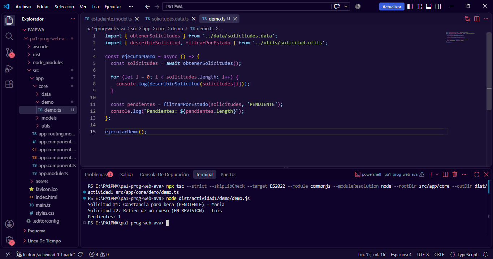

Actividad 1: Base tipada y modular del caso

Integrante responsable: Valeria Ravina Pérez 

1. Estructura:

Todo está en `src/app/core`, separado por carpetas:

- models: los tipos e interfaces (Estudiante, Solicitud)
- utils: las funciones que trabajan con las solicitudes
- data: datos de ejemplo y la consulta con async/await
- demo: archivo que ejecuta todo para comprobarlo

Separé tipos, lógica y datos para que cada archivo haga una sola cosa. Cada archivo es un módulo con export e import. No usé namespace porque angular se organiza con modulos.

2. Decisiones de tipado:

- Use interfaces para definir los datos de "Estudiante" y "Solicitud"
- El tipo, el estado y la prioridad usan valores fijos ('BAJA' | 'MEDIA' | 'ALTA'). Así TypeScript avisa si escribo un valor que no existe.
- "observacion?" es opcional porque una solicitud nueva todavía no tiene observación
- "NuevaSolicitud" es una interfaz aparte porque el usuario no llena el id, el estado ni la fecha

3. Recursos de ES6+ de la sesion 1:

- const y let
- Arrow functions
- Template literals
- Destructuring, incluso anidado
- Promesas y async/await con try/catch

4. Compilación y ejecución:

Se compilo con tsc en modo strict y se ejecuto con node. Usé skipLibCheck para que no revise los archivos de tipos de node_modules

```
npx tsc --strict --skipLibCheck --target ES2022 --module commonjs --moduleResolution node --rootDir src/app/core --outDir dist/actividad1 src/app/core/demo/demo.ts
node dist/actividad1/demo/demo.js
```

